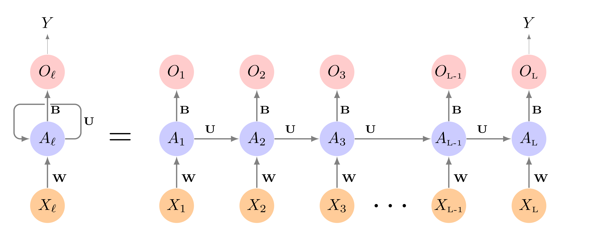
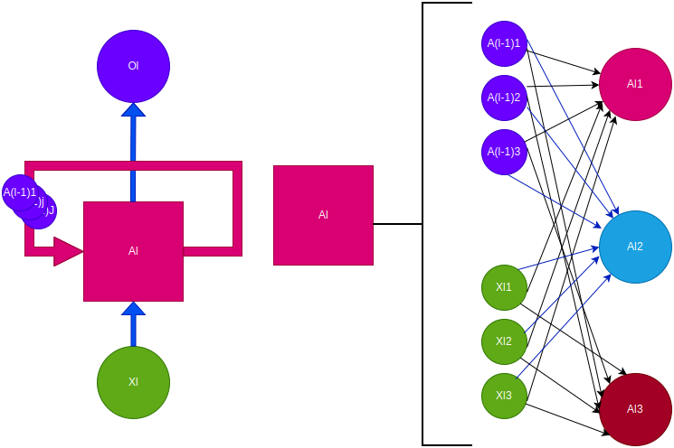

## R Packages


```r
# install.packages("tsibble")
# install.packages("tsibbledata")

library(torch)
library(luz) # high-level interface for torch
library(tsibble)
library(tsibbledata)
torch_manual_seed(909)
```

Here is the complete [R Code File](https://m408.inqs.info/lectures/R/10a.R)

## Python Data


```python
import pandas as pd
vic_elec = pd.read_csv("https://raw.githubusercontent.com/inqs909/m408_s26/refs/heads/main/lectures/data/vic_elec.csv")

```

# Sequential Data

## Sequential Data

Sequential data is data that is obtained in a series:

$$
X_{(0)}\rightarrow
X_{(1)}\rightarrow
X_{(2)}\rightarrow
X_{(3)}\rightarrow
\cdots\rightarrow
X_{(J-1)}\rightarrow
X_{(J)}
$$

## Stochastic Procceses

A stochastic process is a collection of random variables, that can be indexed by a parameters. Sequential data can be thought of as a stochastic process.

::: fragment
The generation of a variable $X_{(j)}$ may or may not be dependent of the previous values.
:::

## Examples of Sequential Data

-   Documents and Books

-   Temperature

-   Stock Prices

-   Speech/Recordings

-   Handwriting

# Long Short-term Memory

## RNN

Recurrent Neural Networks are designed to analyze input data that is sequential data.

::: fragment
An RNN can accounts for the position of a data point in the sequence as well as the distance it has to other data points.
:::

::: fragment
Using the data sequence, we can predict and outcome $Y$.
:::

## RNN



## RNN Neuron



## Problems with RNN

- Recurrent Neural Networks suffer from exploding or disappearing gradient due the unfolding.

## LSTM

The **Long Short-Term Memory** approach is used to conteract the issues with gradients by adding a "memory" structure to the nuerons. 

::: {.fragment}
This is done by incorporating 2 pathways, a long-term and short-term pathway.
:::

## LSTM Components

The creation of the 2 pathways are constructed using 3 "gates":

- Input Gate
- Output Gate
- Forget Gate

::: {.fragment}
Additionally, LSTM uses sigmoid and hyperbolic tangent activation functions to see what values will be incorporated into the pathways. 
:::

## LSTM Neuron


## LSTM Architecture


## Forget Gate

The **forget gate** decides what information is useful from the long-term memory, and what information should be forgotten. The function below states what percent of the long-term memory should be remembered.
$$
f_t = \sigma\left(\boldsymbol W_f [h_{t-1}, x_t] + b_f\right)
$$

- $W_f$ is the weighting matrix full of parameters
- $b_f$ is the bias term

## Input Gate

The **input gate** controls how the long term memory should be modified based on both the short-term memory and the new input. The $i_t$ function tells us what percent should be remembered, and $j_t$ tells us what to remember.
$$
i_t = \sigma\left(\boldsymbol W_i [h_{t-1}, x_t] + b_i\right)
$$

$$
j_t = \tanh\left(\boldsymbol W_j [h_{t-1}, x_t] + b_j\right)
$$

- $W_i$ and $W_j$ is the weighting matrix full of parameters
- $b_i$ and $b_j$ is the bias term


## Long-term Memory

This is how the long-term memory is modified

$$
C_t = f_t \bigodot C_{t-1} + i_t \bigodot j_t
$$

- $\bigodot$ is the element-wise multiplication of the vectors

## Output Gate

The **output gate** tells us how is the short-term memory is updated. This is dony by figuring out what percent will be used from the new long-term memory.

$$
o_t = \sigma\left(\boldsymbol W_o [h_{t-1}, x_t] + b_o\right)
$$

- $W_o$ is the weighting matrix full of parameters
- $b_o$ is the bias term

## Short-term Memory

The short-term memory is costructed by combining the output gate and new long-term memory.
$$
h_t = o_t\tanh\left(C_t\right)
$$

This is also the new predicted value.

# Predicting Electricity Demand

## Predicting Electricity Demand

We will use the `vic_elec` data set to be able to predict what the demand will be in a future time point.

## Data Set

In order to fit a model with Torch, we need to provide a data set funcion that provides 2 values, a set of input and set of output. With Sequential data, values may be both outputs and inputs. We will use the `dataset()` to ensure that values can be used as both output and input.

## RNN Neuron

Instead of the standard RNN Neuron, we will implement the *Long Short-Term Memory* Neuron.

## Data Set

::: panel-tabset

### Data

```{r}
# install.packages("torchdatasets")
# install.packages("feasts")

library(tidyverse)
library(torch)
library(luz) # high-level interface for torch

torch_manual_seed(909)
library(tsibble)
library(tsibbledata)
vic_ele
```


### `dataset()`

```{r}
demand_dataset <- dataset(
  name = "demand_dataset",
  initialize = function(x,
                        n_timesteps,
                        n_forecast,
                        sample_frac = 1) {
    self$n_timesteps <- n_timesteps
    self$n_forecast <- n_forecast
    self$x <- torch_tensor((x - train_mean) / train_sd)

    n <- length(self$x) -
      self$n_timesteps - self$n_forecast + 1

    self$starts <- sort(sample.int(
      n = n,
      size = n * sample_frac
    ))
  },
  .getitem = function(i) {
    start <- self$starts[i]
    end <- start + self$n_timesteps - 1

    list(
      x = self$x[start:end],
      y = self$x[(end + 1):(end + self$n_forecast)]$
        squeeze(2)
    )
  },
  .length = function() {
    length(self$starts)
  }
)

```

### Prep

```{r}
demand_hourly <- vic_elec |> 
  index_by(Hour = floor_date(Time, "hour")) |> 
  summarise(
    Demand = sum(Demand))

demand_train <- demand_hourly |> 
  filter(year(Hour) == 2012) |> 
  as_tibble() |> 
  select(Demand) |> 
  as.matrix()

demand_valid <- demand_hourly |> 
  filter(year(Hour) == 2013) |> 
  as_tibble() |> 
  select(Demand) |> 
  as.matrix()

demand_test <- demand_hourly |> 
  filter(year(Hour) == 2014) |> 
  as_tibble() |> 
  select(Demand) |> 
  as.matrix()

train_mean <- mean(demand_train)
train_sd <- sd(demand_train)

n_timesteps <- 7 * 24
n_forecast <- 7 * 24
```


### Final

```{r}
train_ds <- demand_dataset(
  demand_train,
  n_timesteps,
  n_forecast,
  sample_frac = 1
)
valid_ds <- demand_dataset(
  demand_valid,
  n_timesteps,
  n_forecast,
  sample_frac = 1
)
test_ds <- demand_dataset(
  demand_test,
  n_timesteps,
  n_forecast
)
```


### Batches

```{r}
batch_size <- 128
train_dl <- train_ds |> 
  dataloader(batch_size = batch_size, shuffle = TRUE)
valid_dl <- valid_ds |> 
  dataloader(batch_size = batch_size)
test_dl <- test_ds |> 
  dataloader(batch_size = length(test_ds))
```

:::

## Model

::: panel-tabset

### Model

```{r}


model <- nn_module(
  initialize = function(input_size,
                        hidden_size,
                        linear_size,
                        output_size,
                        dropout = 0.2,
                        num_layers = 1,
                        rec_dropout = 0) {
    self$num_layers <- num_layers

    self$rnn <- nn_lstm(
      input_size = input_size,
      hidden_size = hidden_size,
      num_layers = num_layers,
      dropout = rec_dropout,
      batch_first = TRUE
    )

    self$dropout <- nn_dropout(dropout)
    self$mlp <- nn_sequential(
      nn_linear(hidden_size, linear_size),
      nn_relu(),
      nn_dropout(dropout),
      nn_linear(linear_size, output_size)
    )
  },
  forward = function(x) {
    x <- self$rnn(x)[[2]][[1]][self$num_layers, , ] |> 
      self$mlp()
  }
)
```

### Initialize


```{r}
  initialize = function(input_size,
                        hidden_size,
                        dropout = 0.2,
                        num_layers = 1,
                        rec_dropout = 0) {
    self$num_layers <- num_layers

    self$rnn <- nn_lstm(
      input_size = input_size,
      hidden_size = hidden_size,
      num_layers = num_layers,
      dropout = rec_dropout,
      batch_first = TRUE
    )

    self$dropout <- nn_dropout(dropout)
    self$output <- nn_linear(hidden_size, 1)
  }
```

### Forward


```{r}
  forward = function(x) {
    (x |> 
      self$rnn())[[1]][, dim(x)[2], ] |> 
      self$dropout() |> 
      self$output()
  }
```

:::

## Training

::: panel-tabset

### Setup


```{r}
input_size <- 1
hidden_size <- 32
linear_size <- 512
dropout <- 0.5
num_layers <- 2
rec_dropout <- 0.2

model <- model |> 
  setup(optimizer = optim_adam, loss = nn_mse_loss()) |> 
  set_hparams(
    input_size = input_size,
    hidden_size = hidden_size,
    linear_size = linear_size,
    output_size = n_forecast,
    num_layers = num_layers,
    rec_dropout = rec_dropout
  )


```


### Train

```{r}
fitted <- model |> 
  fit(train_dl, epochs = 30, valid_data = valid_dl,
      verbose = TRUE)

```

### Evaluate


```{r}

plot(fitted)

evaluate(fitted, test_dl)
```

:::


## Predict and Visualize


```{r}

demand_viz <- demand_hourly |> 
  filter(year(Hour) == 2014, month(Hour) == 12)

demand_viz_matrix <- demand_viz |> 
  as_tibble() |> 
  select(Demand) |> 
  as.matrix()

n_obs <- nrow(demand_viz_matrix)

viz_ds <- demand_dataset(
  demand_viz_matrix,
  n_timesteps,
  n_forecast
)
viz_dl <- viz_ds |> 
  dataloader(batch_size = length(viz_ds))

preds <- predict(fitted, viz_dl)
preds <- preds$to(device = "cpu") |> 
  as.matrix()

example_preds <- vector(mode = "list", length = 3)
example_indices <- c(1, 201, 401)

for (i in seq_along(example_indices)) {
  cur_obs <- example_indices[i]
  example_preds[[i]] <- c(
    rep(NA, n_timesteps + cur_obs - 1),
    preds[cur_obs, ],
    rep(
      NA,
      n_obs - cur_obs + 1 - n_timesteps - n_forecast
    )
  )
}

pred_ts <- demand_viz |> 
  select(Demand) |> 
  add_column(
    p1 = example_preds[[1]] * train_sd + train_mean,
    p2 = example_preds[[2]] * train_sd + train_mean,
    p3 = example_preds[[3]] * train_sd + train_mean) |> 
  pivot_longer(-Hour) |> 
  update_tsibble(key = name)

pred_ts |> 
    ggplot(aes(Hour, value, color = name)) +
      geom_line() +
  scale_colour_manual(
    values = c(
      "#08c5d1", "#00353f", "#ffbf66", "#d46f4d"
    )
  ) +
  theme_minimal() +
  theme(legend.position = "None")


```