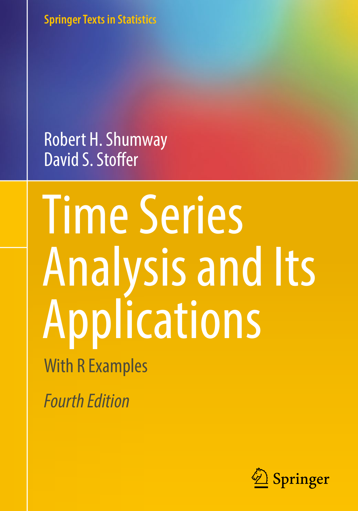

## R Packages

## R Packages

```r
# install.packages("tsibble")
# install.packages("tsibbledata")

library(torch)
library(luz) # high-level interface for torch
library(tsibble)
library(tsibbledata)
torch_manual_seed(909)
```

## Python Data


```python

import pandas as pd

vic_elec <- pd.read_csv()

```

# Sequential Data

## Sequential Data

Sequential data is data that is obtained in a series:

$$
X_{(0)}\rightarrow
X_{(1)}\rightarrow
X_{(2)}\rightarrow
X_{(3)}\rightarrow
\cdots\rightarrow
X_{(J-1)}\rightarrow
X_{(J)}
$$

## Stochastic Procceses

A stochastic process is a collection of random variables, that can be indexed by a parameters. Sequential data can be thought of as a stochastic process.

::: fragment
The generation of a variable $X_{(j)}$ may or may not be dependent of the previous values.
:::

## Examples of Sequential Data

-   Documents and Books

-   Temperature

-   Stock Prices

-   Speech/Recordings

-   Handwriting

# Recurrent Neural Networks

## RNN

Recurrent Neural Networks are designed to analyze input data that is sequential data.

::: fragment
An RNN can accounts for the position of a data point in the sequence as well as the distance it has to other data points.
:::

::: fragment
Using the data sequence, we can predict and outcome $Y$.
:::

## RNN


## RNN Inputs

$$
\boldsymbol X = (\boldsymbol x_0, \boldsymbol x_1, \boldsymbol x_2, \cdots, \boldsymbol x_{J-1}, \boldsymbol x_J)
$$ 

where

$$
\boldsymbol x_{j} = (x_{j1},x_{j1}, \cdots, x_{jK})
$$

## Hidden Layer

$$
h_{j} = f(\bbeta_{hx}\boldsymbol x_{j} + \bbeta_{hh}h_{j-1} + b_h)
$$

-   $\bbeta_{hx}$ and $\bbeta_{hh}$ are weight vectors for input-to-hidden, and hidden-to-hidden connections respectively.

## Output Layer

$$
y_{j} = g(\bbeta_{hy}h_{j} + b_y)
$$

# Time Series

## Time Series

A time series is a sequence of data points collected or recorded at successive, evenly spaced intervals of time. These data points can represent any variable that is observed or measured over time, such as temperature readings, stock prices, sales figures, or sensor data.

## Autocorrelation


$$
X_{(0)}\rightarrow
X_{(1)}\rightarrow
X_{(2)}\rightarrow
X_{(3)}\rightarrow
\cdots\rightarrow
X_{(J-1)}\rightarrow
X_{(J)}
$$

## More Information



## RNN

A recurrent neural network can be used to account the sequential order of each measurement.


# Predicting Electricity

## Data Set


